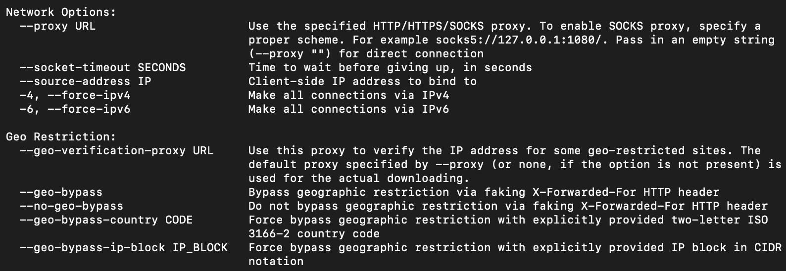

### Usage Setting

1. Video & Audio format

   ``` shell
   -f 137+140 
   # 140: m4a_dash container, mp4a.40.2@128k (44100Hz)
   # 137: avc1.640028, 30fps, video only, namely 1920*1080 mp4.
   ```

   Using youtube-dl in shell, instead of running the shell script in AppleScript will download the best format for video and audio preferentially. 

   

2. Proxy Setting…(waiting for update)

   

3.  External-downloader

4.  List

   ```
   --no-playlist     
   #Download only the video, if the URL refers to a video and a playlist.
   --yes-playlist     
   #Download the playlist, if the URL refers to a video and a playlist.
   ```

5. ID

   ```shell
   --id	
   # Use only video ID in file name
   ```

6. Mainland Internet connect

   ```shell
   until youtube-dl https://www.example.com; do sleep 5 ; done
   ```

### Personal Config Procession


1. Add the following in .bash/profile

### Install

​	find config file in the following route `/.config/youtube-dl`

- youtube-dl --proxy 127.0.0.1:1087 --no-check-certificate https://www.youtube.com/watch?v=F9mBUwgk718
- just like this

### Automator

1. write a shell file with the name"dl.sh", save all the shell script in the finder of ","

   ```
   until youtube-dl `pbpaste`; do sleep 5 ; done
   ```

2. Tap `./,/d` , press "tap", then press enter

## FFMPEG Download Digital Concert Hall

[](https://www.digitalconcerthall.com/en/)

The main idea is download through ffmpeg with m3u8. 

### Url form and transform

1. The numbering scheme of this concert has a structure of "xxxxx-y", xxxxx is the number of this concert, y is the number of some special part of this concert.

2. Useas a example video of Berlin Philarmoniker's Digital Concert Hall. 

3. The url will be transformed into m3u8 url.

   <https://www.digitalconcerthall.com/en/concert/52519> 

   <https://world-vod.dchdns.net/hlss/dch/52519-1/h264_VERY_HIGH_ONE.mp4/index-v1-a1.m3u8> 

   the first one represents 52519 is the numbering scheme of this concert. the second one will link to the first chapter of this concert, namely beethoven piano concerto no.3 performed by Daniel Barenboim and Kirill Petrenko

4. Some old video (approximately number before 10000) will add ***_en*** before ***.mp4***

   ```
   https://world-vod.dchdns.net/hlss/dch/xxxx-y/h264_VERY_HIGH_ONE_en.mp4/index-v1-a1.m3u8
   https://world-vod.dchdns.net/hlss/dch/xxxxx-y/h264_VERY_HIGH_ONE.mp4/index-v1-a1.m3u8 
   ```

5. If you're in the Great China Area. Heavy recommend that you just stay here and watch the video online without internet tools such as ssr or vpn. Video can be watched without internet tools, but even with the help of these tools, the download speed is still around 100MB per 10 minutes

### Example Code

```shell
# Both ways work. The following way comes from Yudong Wang
ffmpeg -allowed_extensions ALL -protocol_whitelist "file,http,crypto,tcp,tls,https" -i https://world-vod.dchdns.net/hlss/dch/52519-1/h264_VERY_HIGH_ONE.mp4/index-v1-a1.m3u8 -vcodec copy -acodec copy BeethovenPC3.mp4
# The following way comes from Bilibili
ffmpeg -i "https://world-vod.dchdns.net/hlss/dch/51040-2/h264_VERY_HIGH_ONE.mp4/index-v1-a1.m3u8" -bsf:a aac_adtstoasc -vcodec copy -c copy BerlinPhil/Bartok:\ ViolaConcerto.mp4
# The default address is the User/youraccount
```


## Mkv及webm的自我科普；