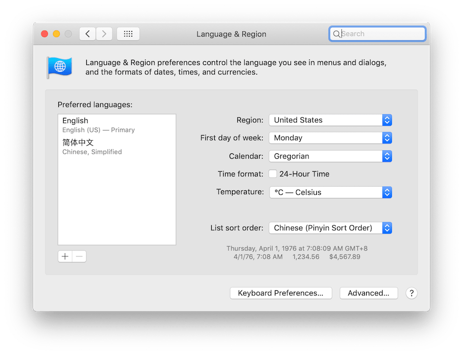
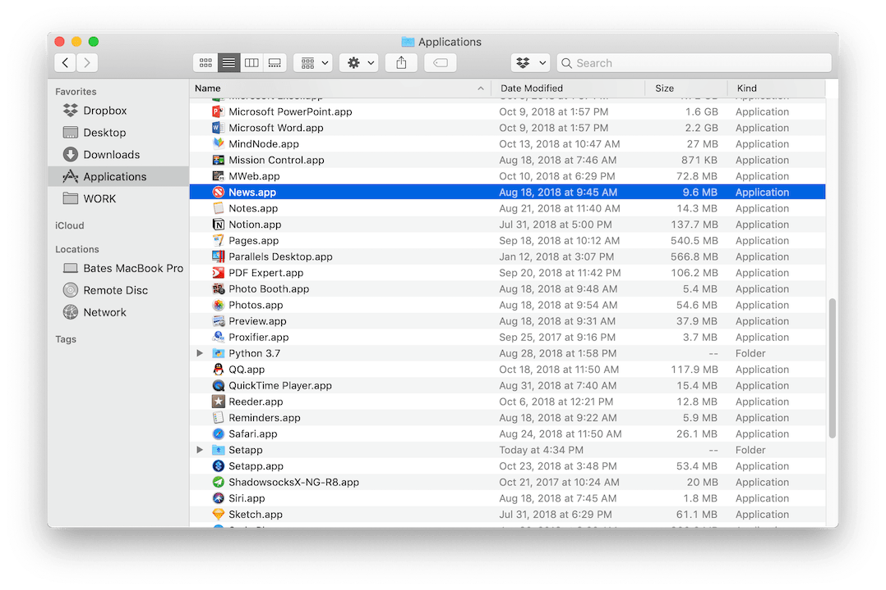

- 本文方法主要来自 [Reference](#Reference) ，出于个人操作备份的需求转载编辑，并用于Markdown排版的学习

- 本文在编写过程中使用Clash X作为代理，在Rule Mode与Shadowsocks-NG-R8相比有更高的可编辑性，

## Shell基本代理配置

Clash X `command + C` Copy Shell Command 输出为

```shell
export https_proxy=http://127.0.0.1:7890 http_proxy=http://127.0.0.1:7890 all_proxy=socks5://127.0.0.1:7891
```

在终端的对应profile文件，编辑加入对应的内容，我就很随意的加在 ***bash_profile*** 了，大雾

```shell
export https_proxy=http://127.0.0.1:7890
export http_proxy=http://127.0.0.1:7890
export all_proxy=socks5://127.0.0.1:7891
##上面的三行命令表示,每次新建一个终端会话时,默认让终端去走代理,这样就不需要每次都复制拷贝一下了,很方便,同时,代理程序去智能分流(国内 IP 直连,国外走代理)，避免了连接国内 IP 地址时“绕远”.


alias setproxy="export https_proxy=http://127.0.0.1:7890;export http_proxy=http://127.0.0.1:7890;export all_proxy=socks5://127.0.0.1:7891;echo \"Set proxy successfully\" "
alias unsetproxy="unset http_proxy;unset https_proxy;unset all_proxy;echo \"Unset proxy successfully\" " 
alias ipcn="curl myip.ipip.net"
alias ip="curl ip.sb"


## 上面这几个 alias 是自定义的命令
## unsetproxy 取消代理
## setproxy 设置代理
## ip & ipcn  查看 终端IP & 实际IP
```

## Git代理配置

```shell
Host *
    ProxyCommand nc -X 5 -x localhost:7891 %h %p
##第一行代表所有的 ssh 的主机
##第二行代表让所有的 ssh 的主机在连接的时候,通过你本地的端口为 7891 的 socks5 代理去连接,一般来讲,本地的 socks5 都是由翻墙工具提供
##诸如 Surge  ClashX 或者 Ssr,所以,7891这个端口需要换成对应的服务端口即可
```


# 各个流化服务对于代理的要求

我们使用墙建的最高的Apple News来作为参考，了解解决District Restrictions的最高方式

## iPhone/iPad 设备上使用 Apple News

**第一步：在主屏上显示 Apple News**

- iTunes & App Store 账号更换为美区
- 设置- 通用- 语言/地区 中，切换地区为美国

这里需要介绍一下 Apple ID，iOS 上登陆的 Apple ID (苹果账号) 一般用于两种服务。一是 iCloud 文件及系统安全，二是用于 iTunes & App Store等购买服务。

在 iOS 的设置中 退出 iTunes & App Store 的登陆，换成[美区 Apple ID](https://digitalimmigrant.org/171)，Apple News, Apple TV 等软件就会出现在设备上了。

**第二步：正常使用 Apple News**

完成第一步，你在几乎所有国家都可以正常使用 Apple News 了。仅仅中国特殊，不但检测 IP地址，若发现 MCC ([移动设备国家代码](https://en.wikipedia.org/wiki/Mobile_country_code)) 是中国，则提示无法在地区使用。

在 iPhone 上需开启飞行模式。打开 Wi-Fi，使用 VPN 或者[SS类软件](https://shadowsocks.org/en/index.html)的全局代理。iOS 上，Apple News 对代理的 IP 没有特别限制，但建议使用主运营区域的。**但必须开启飞行模式这一点，等于屏蔽移动网络，代价很大且不具有普适性。**

若在没有插 SIM卡的 iPad 上，使用 VPN 或者SS类软件的全局代理即可。常在Wi-Fi网络下扔着的 iPad 更适合用来阅读新闻等。

**第三步：Trouble Shooting**
如果按照上述步骤一步一步操作仍不可用，或者本来可用，突然不可用。可以尝试在 设置中搜索 “Location” 选择 “Reset location and privacy”，这样可以重置对所有 APP 及服务的授权，重新打开 News 时关闭地理位置授权即可。

如果是购买国内常用的 SS 代理服务，部分美区节点可能没有被苹果识别为美国，多切换几个节点尝试。

## Mac 设备上使用 Apple News

**第一步：在主屏上显示 Apple News**



macOS 需升级到10.14 macOS Mojave。MacOS 上仅需要在 系统设置-语言与地区 中将地区更改为 美国，Apple News 就会出现在应用页面。若仍未出现，可以在 应用程序 中查看到，按住拖到 dock 栏方便使用。



**第二步：正常使用 Apple News**
点开 Apple News， 很可能会提示该地区不支持。使用 VPN 或者[SS类软件](https://shadowsocks.org/en/index.html)的全局代理。更换代理后，双击dock 上的 Apple News 选择关闭，然后打开即可。若经常使用全局代理不方便，也可以考虑使用 [Proxifier ](https://digitalimmigrant.org/44)针对电脑上的每个软件分别设置代理策略。

如果是 Surge 用户，开启增强模式后，增加针对 News 的进程代理美国IP地址即可。如果是其他代理软件，觉得全局代理的体验较差，可以新增规则，将 `apple.news` 域名设置为Proxy，将 `apple.comscoreresearch.com` 设置为 Deny。

注意，与iOS不同，macOS 上对 IP 地址还是有要求的，若使用加拿大或者其他非 Apple News 运营地区的 IP地址，仍会显示为该地区不支持。

**第三步：Trouble Shooting**
如果是购买国内常用的 SS 代理服务，部分美区节点可能没有被苹果识别为美国，多切换几个节点尝试。

如果仍有问题，建议邮件联系 [hi@shuziyimin.org](https://blog.shuziyimin.org/hi@shuziyimin.org) 以获得最快速的回复。

## 个人处理过程中的一些经验主义

### 个人经验

	1. Apple News 在 iOS 端稳定使用后能形成一个 iMessage 的表情包
 	2. 一切问题都能通过基本的**断 Wi-Fi + 开飞行模式**得到解决

### 与 *Bates* 的信件往来

Send:

> 请问在Mac上只能看Apple News不能看News + 怎么处理啊？
>
> 使用美国SS节点，美区ID并将地址和语言改成美区和英文。但是在查看Following的内容的时候会显示地区不能用，而且左侧没有news+窗口。
>
> 是因为代理的问题吗？虽然节点描述是US但是在Google查到的IP是Singapore？
>
> （图片因为个人排版原因就不放了，当时也没好好截）

Reply:

> 您好，
>
> 显示不支持该地区 与 不显示 news+ 都是因为系统识别IP地址为非运营地区。虽然节点显示为美国，但各个企业都有自己的IP地址库，识别有差异也是正常的。
>
> **原因1 你使用的软件全局代理依旧无法保证 apple news 所有流量走代理**
>
> **原因2 节点的 IP地址没被识别为可运营地区的。**
>
> 解决办法是 
>
> **使用 Mac surge试用版，开启增强模式，重启电脑后看看是否还是不支持。**
>
> **如果支持，确定是原因1， 可以换用代理软件为 surge 也可以使用  shadowsocks + proxifier 方案，也可以使用VPN方案而非 shadoowsocks 协议。 **
>
> **如果不支持，确认是原因2，更换节点多试试。**
>
> Bates

# Reference

1. [Eccon's Blog 配置终端走代理，Git 走代理](https://www.xbug.me/post/2018-12-03-Terminal-use-proxy.html)
2. [数字移民 在中国如何使用 Apple News？](https://blog.shuziyimin.org/211)


[TOC]

